---
## Author
author:
  name: Соколова Александра Олеговна
  degrees: DSc
  orcid: 0000-0002-0877-7063
  email: 1132236034@rudn.ru
  affiliation:
    - name: Российский университет дружбы народов
      country: Российская Федерация
      postal-code: 117198
      city: Москва
      address: ул. Миклухо-Маклая, д. 7 к. 1
## Title
title: Презентация по лабораторной работе №4
subtitle: Имитационное моделирование
license: CC BY
date: today
date-format: "YYYY-MM-DD" # Example: 2025-09-06
---
## Цель работы

Реализовать эпидемиологическую модель SIR (Susceptible-Infectious-Recovered) в рамках агентного подхода с использованием пакета Agents.jl в среде Julia. Научиться проводить вычислительные эксперименты с агентной моделью: исследовать влияние параметров заразности и миграции на динамику эпидемии, выполнять многокритериальную оптимизацию параметров, а также освоить методы визуализации и анализа результатов агентного моделирования.

## Подготовка рабочего пространства

Создаем проект DrWatson для выполнения лабораторной работы ([рис. @fig-001]).

{#fig-001 width=70%}

## Подготовка рабочего пространства

Загружаем необходимые пакеты ([рис. @fig-002]).

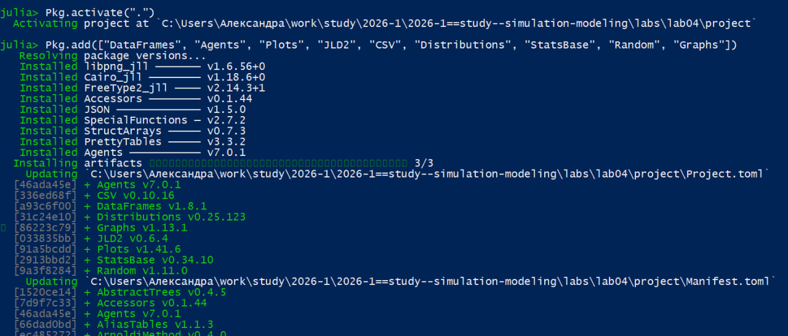{#fig-002 width=70%}

## Код модели

Создаем файл src/sir_model.jl и записываем туда код модели из методички ([рис. @fig-003]).

{#fig-003 width=70%}

## Базовый эксперимент

Создаем файл scripts/sir_run_basic.jl и добавляем туда скрипт из методички для реализации базового эксперимента ([рис. @fig-004]).

{#fig-004 width=70%}

## Базовый эксперимент

Запускаем scripts/sir_run_basic.jl командой "julia --project=. scripts/sir_run_basic.jl". График сохраняется в папку "plots" ([рис. @fig-005]).

{#fig-005 width=70%}

## Базовый эксперимент

Просмотрим результаты в папке "Plots". График ппозволяет визуально оценить пик эпидемии,
скорость распространения и влияние смертности. ([рис. @fig-006]).

{#fig-006 width=70%}

## Базовый эксперимент

Создаем файл sir_run_basic_literate.jl для литературной версии кода ([рис. @fig-007]).

{#fig-007 width=70%}

## Базовый эксперимент

Генерируем чистый код, jupyter notebook и документацию в формате Quarto с помощью tangle.jl ([рис. @fig-008]).

{#fig-008 width=70%}

## Базовый эксперимент

Открываем jupyter notebook и проверяем что все коды успешно запускаются ([рис. @fig-009]).

{#fig-009 width=70%}

## Сканирование коэффициента заразности

Создаем файл scripts/sir_scan_beta.jl и добавляем туда скрипт из методички для реализации сканирования коэффициента заразности ([рис. @fig-010]).

{#fig-010 width=70%}

## Сканирование коэффициента заразности

Запускаем scripts/sir_scan_beta.jl командой "julia --project=. scripts/sir_scan_beta.jl". График сохраняется в папку "plots" ([рис. @fig-011]).

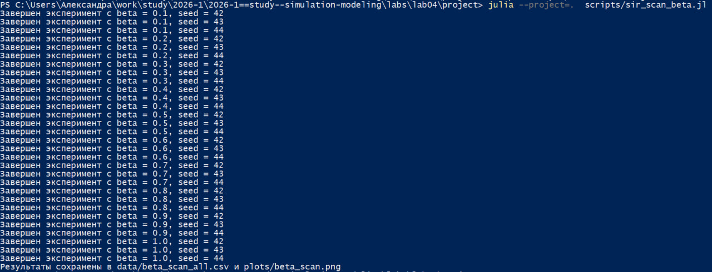{#fig-011 width=70%}

## Сканирование коэффициента заразности

Просмотрим результаты в папке "Plots". График показывает зависимость от 𝛽:

— средняя пиковая доля инфицированных;

— средняя конечная доля инфицированных;

— средняя доля умерших (нормированная на численность).

График позволяет найти пороговое значение 𝛽, при котором возникает эпидемия,
и оценить, как увеличивается нагрузка на систему с ростом заразности ([рис. @fig-012]).

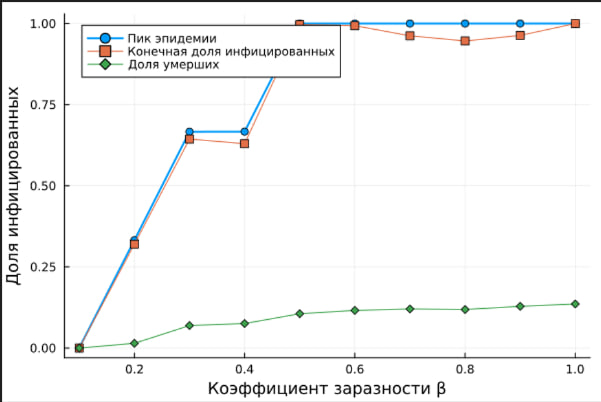{#fig-012 width=70%}

## Сканирование коэффициента заразности

Создаем файл sir_scan_beta_literate.jl для литературной версии кода ([рис. @fig-013]).

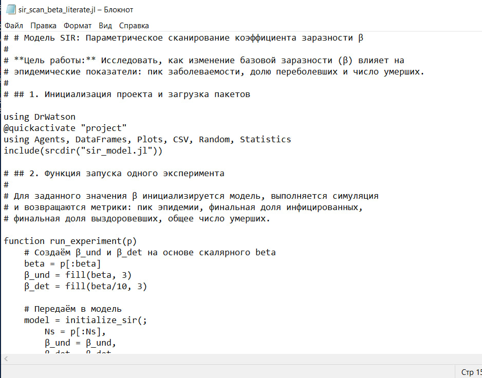{#fig-013 width=70%}

## Сканирование коэффициента заразности

Генерируем чистый код, jupyter notebook и документацию в формате Quarto с помощью tangle.jl ([рис. @fig-014]).

{#fig-014 width=70%}

## Сканирование коэффициента заразности

Открываем jupyter notebook и проверяем что все коды успешно запускаются ([рис. @fig-015]).

{#fig-015 width=70%}

## Исследование эффекта миграции

Создаем файл scripts/sir_migration_effect.jl и добавляем туда скрипт из методички для исследования эффекта миграции ([рис. @fig-016]).

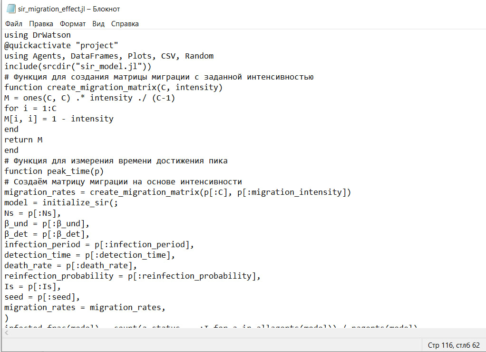{#fig-016 width=70%}

## Исследование эффекта миграции

Запускаем scripts/sir_migration_effect.jl командой "julia --project=. scripts/sir_migration_effect.jl". График сохраняется в папку "plots" ([рис. @fig-017]).

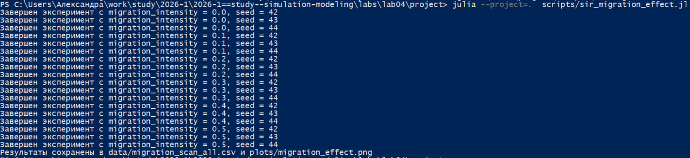{#fig-017 width=70%}

## Исследование эффекта миграции

Просмотрим результаты в папке "Plots". График показывает:

— время достижения пика (в днях) vs интенсивность миграции;

— пиковую численность инфицированных vs интенсивность миграции.

График демонстрирует, как ускорение обмена людьми между городами приводит
к более раннему и более высокому пику эпидемии ([рис. @fig-018]).

{#fig-018 width=70%}

## Исследование эффекта миграции

Создаем файл sir_migration_effect_literate.jl для литературной версии кода ([рис. @fig-019]).

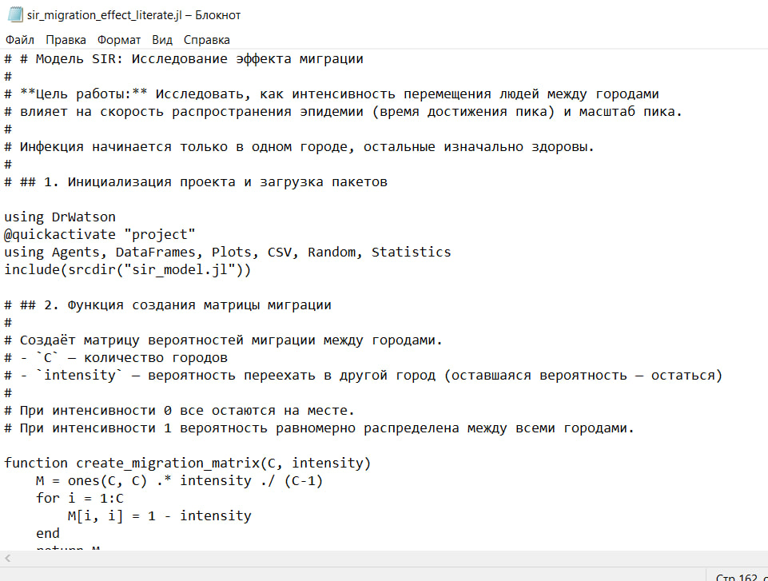{#fig-019 width=70%}

## Исследование эффекта миграции

Генерируем чистый код, jupyter notebook и документацию в формате Quarto с помощью tangle.jl ([рис. @fig-020]).

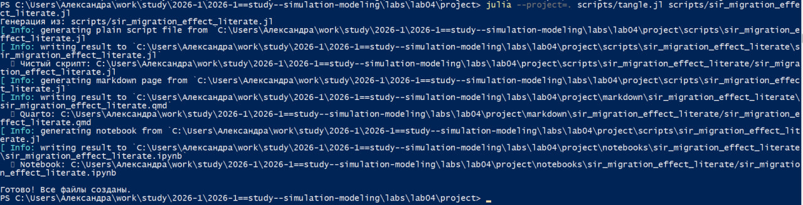{#fig-020 width=70%}

## Исследование эффекта миграции

Открываем jupyter notebook и проверяем что все коды успешно запускаются ([рис. @fig-021]).

{#fig-021 width=70%}

## Многокритериальная оптимизация параметров

Создаем файл scripts/sir_optimize_parameters.jl и добавляем туда скрипт из методички для реализации многокритериальной оптимизации параметров ([рис. @fig-022]).

{#fig-022 width=70%}

## Многокритериальная оптимизация параметров

Запускаем scripts/sir_optimize_parameters.jl командой "julia --project=. scripts/sir_optimize_parameters.jl". После запуска выводятся оптимальные параметры и соответствующие им значения критериев ([рис. @fig-023]).

{#fig-023 width=70%}

## Многокритериальная оптимизация параметров

Создаем файл sir_optimize_parameters_literate.jl для литературной версии кода ([рис. @fig-024]).

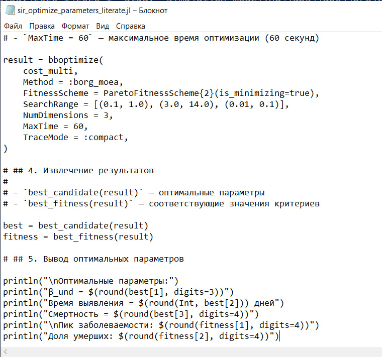{#fig-024 width=70%}

## Многокритериальная оптимизация параметров

Генерируем чистый код, jupyter notebook и документацию в формате Quarto с помощью tangle.jl ([рис. @fig-025]).

{#fig-025 width=70%}

## Многокритериальная оптимизация параметров

Открываем jupyter notebook и проверяем что все коды успешно запускаются ([рис. @fig-026]).

{#fig-026 width=70%}

## Сводная визуализация результатов

Создаем файл scripts/sir_visualize_dynamics.jl и добавляем туда скрипт из методички для реализации сводной визуализации результатов ([рис. @fig-027]).

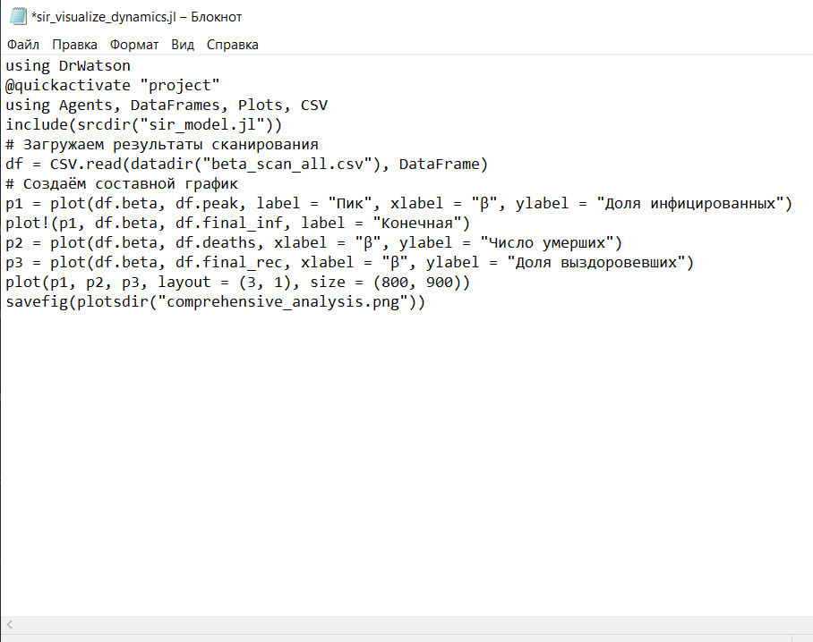{#fig-027 width=70%}

## Сводная визуализация результатов

Запускаем scripts/sir_visualize_dynamics.jl командой "julia --project=. scripts/sir_visualize_dynamics.jl" ([рис. @fig-028]).

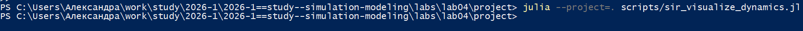{#fig-028 width=70%}

## Сводная визуализация результатов

Просмотрим результаты в папке "Plots".График состоит из трех панелей, позволяющих одновременно оценить:

— порог возникновения эпидемии (рост пика);

— нелинейное увеличение смертности;

— насыщение доли переболевших.

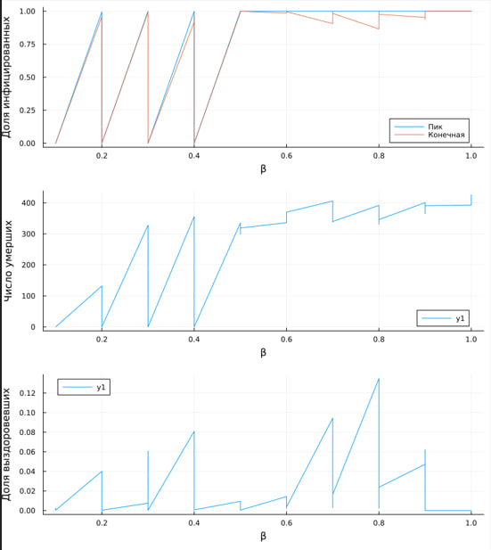{#fig-029 width=70%}

## Сводная визуализация результатов

Создаем файл sir_visualize_dynamics_literate.jl для литературной версии кода ([рис. @fig-030]).

{#fig-030 width=70%}

## Сводная визуализация результатов

Генерируем чистый код, jupyter notebook и документацию в формате Quarto с помощью tangle.jl ([рис. @fig-031]).

{#fig-031 width=70%}

## Сводная визуализация результатов

Открываем jupyter notebook и проверяем что все коды успешно запускаются ([рис. @fig-032]).

{#fig-032 width=70%}

## Выводы

В ходе выполнения лабораторной работы реализована и исследована агентная эпидемиологическая модель SIR с использованием пакетов Agents.jl, DrWatson.jl и BlackBoxOptim.jl.

