---
## Author
author:
  name: Соколова Александра Олеговна
  degrees: DSc
  orcid: 0000-0002-0877-7063
  email: 1132236034@rudn.ru
  affiliation:
    - name: Российский университет дружбы народов
      country: Российская Федерация
      postal-code: 117198
      city: Москва
      address: ул. Миклухо-Маклая, д. 7к1

## Title
title: "Отчёт по лабораторной работе №4"
subtitle: "Имитационное моделированией"
license: "CC BY"
---

# Цель работы

Реализовать эпидемиологическую модель SIR (Susceptible-Infectious-Recovered) в рамках агентного подхода с использованием пакета Agents.jl в среде Julia. Научиться проводить вычислительные эксперименты с агентной моделью: исследовать влияние параметров заразности и миграции на динамику эпидемии, выполнять многокритериальную оптимизацию параметров, а также освоить методы визуализации и анализа результатов агентного моделирования.

# Задание

— Создать рабочий каталог для кода.

— Установить необходимые пакеты.

— Выполнить предложенный код.

— Преобразовать код в литературный стиль.

— Сгенерировать из литературного кода:

- чистый код;
-  jupyter notebook;
- документацию в формате Quarto.

— Выполнить код из jupyter notebook.

— Интегрировать документацию в формате Quarto в отчёт.

— Добавить в код в литературном стиле вычисление для набора параметров.

— Сгенерировать из литературного кода с параметрами:

- чистый код;
- jupyter notebook;
- документацию в формате Quarto.

— Выполнить код из jupyter notebook с параметрами.

— Интегрировать документацию с параметрами в формате Quarto в отчёт.

# Теоретическое введение

## 1. Модель SIR в эпидемиологии

Модель SIR — это классическая математическая модель, описывающая распространение инфекционного заболевания в замкнутой популяции. Она была предложена Кермаком и Маккендриком в 1927 году. Название модели отражает три состояния, в которых может находиться индивид:

- **S (Susceptible)** — восприимчивые к заболеванию, но ещё не заражённые;
- **I (Infectious)** — инфицированные, способные передавать инфекцию восприимчивым;
- **R (Recovered)** — выздоровевшие (или умершие), приобретшие иммунитет и более не участвующие в распространении болезни.

### 1.1 Классическая модель на дифференциальных уравнениях

В классической детерминированной модели SIR динамика эпидемии описывается системой обыкновенных дифференциальных уравнений:

$$
\begin{aligned}
\frac{dS}{dt} &= -\beta \frac{SI}{N}, \\[2mm]
\frac{dI}{dt} &= \beta \frac{SI}{N} - \gamma I, \\[2mm]
\frac{dR}{dt} &= \gamma I,
\end{aligned}
$$

где:
- $N = S + I + R$ — общая численность популяции (предполагается постоянной);
- $\beta$ — коэффициент передачи инфекции (скорость заражения);
- $\gamma$ — скорость выздоровления ($1/\gamma$ — средняя продолжительность болезни).

**Базовое репродуктивное число** $R_0$ определяется как:

$$
R_0 = \frac{\beta}{\gamma}.
$$

Оно показывает, сколько в среднем людей заражает один больной в полностью восприимчивой популяции:
- если $R_0 > 1$ — эпидемия разрастается;
- если $R_0 < 1$ — вспышка затухает.

### 1.2 Трёхпараметрическая модель SIR

В более реалистичной постановке коэффициент $\beta$ раскладывается на две составляющие:

$$
\beta = c \cdot p,
$$

где:
- $c$ — среднее число контактов одного человека в единицу времени;
- $p$ — вероятность передачи инфекции при одном контакте.

Тогда $R_0$ выражается как:

$$
R_0 = \frac{c \cdot p}{\gamma}.
$$

Такой подход позволяет разделить поведенческий фактор (контакты) и биологический (вероятность заражения), что важно для оценки эффективности мер вмешательства (карантин снижает $c$, маски снижают $p$).

## 2. Агентная модель SIR

В отличие от классического подхода на дифференциальных уравнениях, агентная модель SIR позволяет учесть индивидуальные характеристики агентов, пространственную неоднородность и стохастичность процессов.

### 2.1 Структура модели

В данной лабораторной работе реализована метапопуляционная агентная модель:

- **Агенты** — люди, каждый из которых находится в одном из состояний: `:S`, `:I` или `:R`. Агенты обладают свойством `days_infected` (количество дней с момента заражения для инфицированных).

- **Пространство** — граф, узлы которого соответствуют городам (локациям), а рёбра — возможным миграционным путям между ними. Это позволяет моделировать распространение инфекции между разными группами населения.

- **Параметры модели**:
  - `Ns` — численность населения в каждом городе;
  - `β_und` — вероятность передачи для невыявленных случаев (высокая заразность);
  - `β_det` — вероятность передачи для выявленных случаев (низкая заразность);
  - `infection_period` — длительность заболевания (дней);
  - `detection_time` — время до выявления заболевания;
  - `death_rate` — вероятность летального исхода;
  - `reinfection_probability` — вероятность повторного заражения;
  - `migration_rates` — матрица вероятностей миграции между городами.

### 2.2 Процессы, моделируемые на каждом шаге

На каждом шаге (соответствующем одному дню) для каждого агента выполняются следующие процессы:

1. **Миграция** — агент может переместиться в другой город с вероятностью, задаваемой матрицей `migration_rates`.

2. **Передача инфекции** — если агент инфицирован, он может заразить восприимчивых агентов в той же локации. Количество заражённых за день определяется пуассоновским процессом с интенсивностью, зависящей от статуса выявления (`β_und` или `β_det`).

3. **Обновление счётчика болезни** — для инфицированных увеличивается значение `days_infected`.

4. **Выздоровление или смерть** — если `days_infected` достиг `infection_period`, агент либо выздоравливает (переходит в состояние `:R`), либо умирает (удаляется из модели) с вероятностью `death_rate`.

### 2.3 Преимущества агентного подхода

- **Гетерогенность** — можно задавать индивидуальные параметры для разных агентов.
- **Пространственная структура** — инфекция распространяется локально, а не мгновенно по всей популяции.
- **Стохастичность** — моделируются случайные процессы, что важно для малых популяций.
- **Гибкость** — легко добавлять новые состояния (например, `:E` для латентного периода) или меры контроля (вакцинация, карантин).

## 3. Инструменты реализации в Julia

- **Agents.jl** — высокопроизводительный фреймворк для агентного моделирования, поддерживающий различные типы пространств, автоматический сбор данных и визуализацию.
- **DrWatson.jl** — инструмент для организации воспроизводимых научных проектов, управления симуляциями и параметрическими исследованиями.
- **Literate.jl** — средство для литературного программирования, позволяющее создавать из одного файла чистый код, Jupyter Notebook и документацию в формате Quarto.
- **BlackBoxOptim.jl** — библиотека для многокритериальной оптимизации, используемая для подбора оптимальных параметров модели.

## 4. Этапы моделирования SIR

1. **Инициализация** — создание популяции агентов в нескольких городах, задание начального числа инфицированных.

2. **Миграция** — перемещение агентов между городами согласно матрице вероятностей.

3. **Заражение** — для каждого инфицированного агента моделируется процесс передачи инфекции восприимчивым и реинфекции переболевших.

4. **Обновление состояния** — увеличение счётчика болезни, проверка условий выздоровления или смерти.

5. **Сбор данных** — сохранение численности групп S, I, R на каждом шаге для последующего анализа.

6. **Параметрическое сканирование** — исследование влияния ключевых параметров ($\beta$, интенсивности миграции) на динамику эпидемии.

7. **Оптимизация** — поиск комбинаций параметров, минимизирующих пик заболеваемости и долю умерших.

# Выполнение лабораторной работы

Создаем проект DrWatson для выполнения лабораторной работы ([рис. @fig-001]).

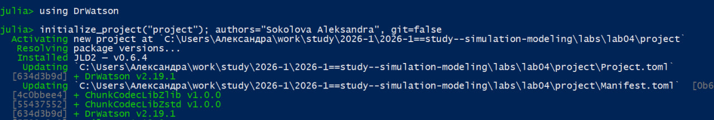{#fig-001 width=70%}

Загружаем необходимые пакеты ([рис. @fig-002]).

{#fig-002 width=70%}

Создаем файл src/sir_model.jl и записываем туда код модели из методички ([рис. @fig-003]).

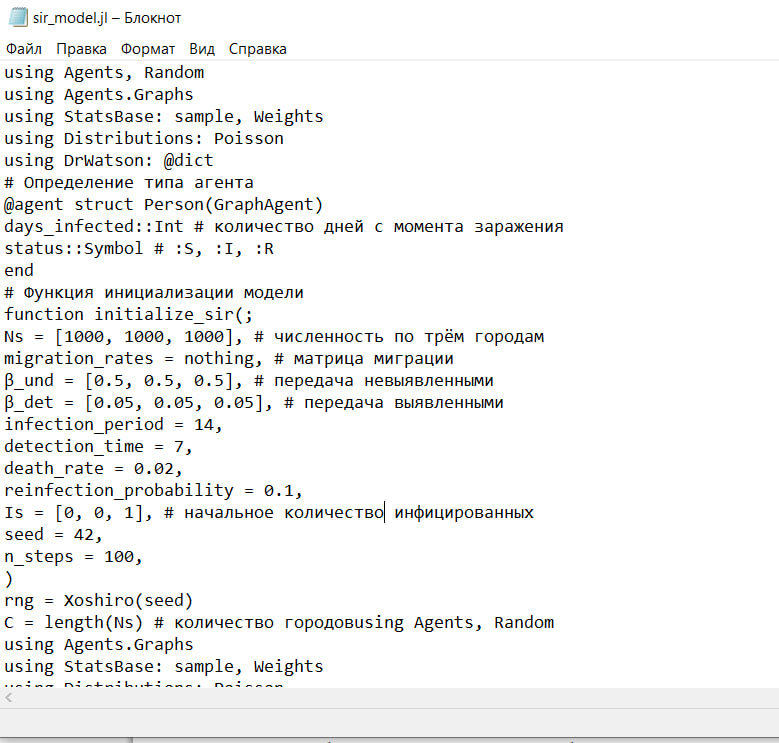{#fig-003 width=70%}

Создаем файл scripts/sir_run_basic.jl и добавляем туда скрипт из методички для реализации базового эксперимента ([рис. @fig-004]).

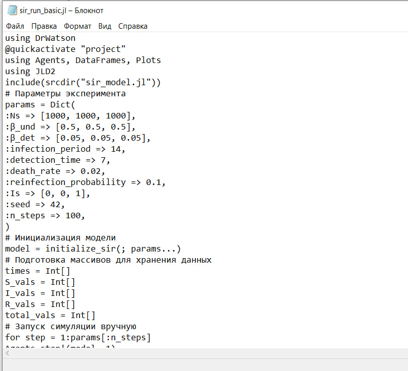{#fig-004 width=70%}

Запускаем scripts/sir_run_basic.jl командой "julia --project=. scripts/sir_run_basic.jl". График сохраняется в папку "plots" ([рис. @fig-005]).

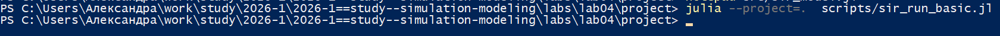{#fig-005 width=70%}

Просмотрим результаты в папке "Plots". График ппозволяет визуально оценить пик эпидемии,
скорость распространения и влияние смертности. ([рис. @fig-006]).

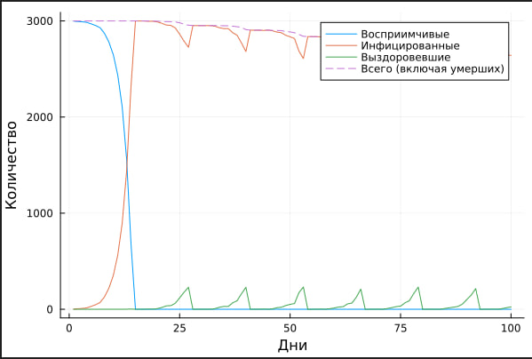{#fig-006 width=70%}

Создаем файл sir_run_basic_literate.jl для литературной версии кода ([рис. @fig-007]).

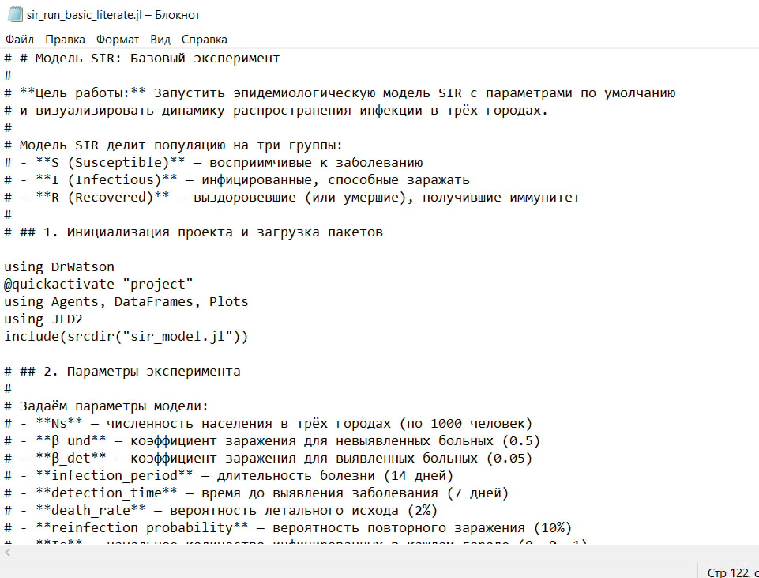{#fig-007 width=70%}

Генерируем чистый код, jupyter notebook и документацию в формате Quarto с помощью tangle.jl ([рис. @fig-008]).

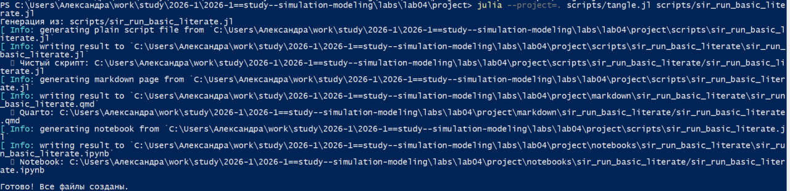{#fig-008 width=70%}

Открываем jupyter notebook и проверяем что все коды успешно запускаются ([рис. @fig-009]).

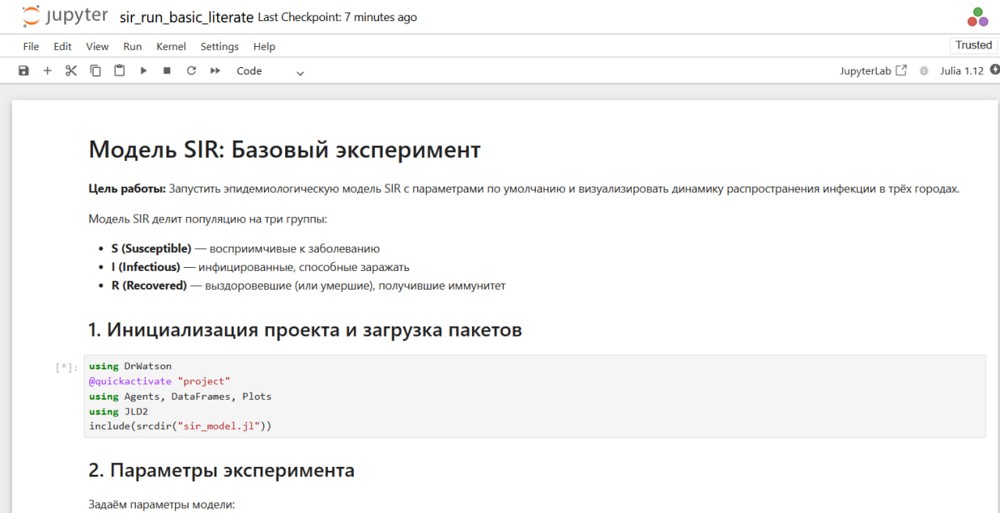{#fig-009 width=70%}

Создаем файл scripts/sir_scan_beta.jl и добавляем туда скрипт из методички для реализации сканирования коэффициента заразности ([рис. @fig-010]).

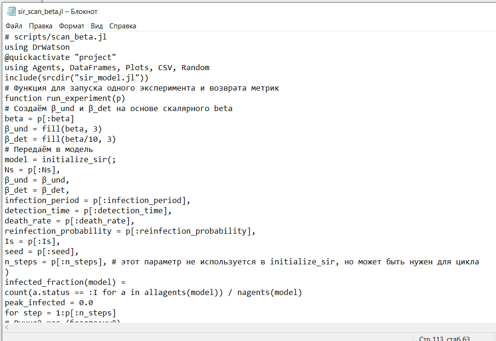{#fig-010 width=70%}

Запускаем scripts/sir_scan_beta.jl командой "julia --project=. scripts/sir_scan_beta.jl". График сохраняется в папку "plots" ([рис. @fig-011]).

{#fig-011 width=70%}

Просмотрим результаты в папке "Plots". График показывает зависимость от 𝛽:

— средняя пиковая доля инфицированных;

— средняя конечная доля инфицированных;

— средняя доля умерших (нормированная на численность).

График позволяет найти пороговое значение 𝛽, при котором возникает эпидемия,
и оценить, как увеличивается нагрузка на систему с ростом заразности ([рис. @fig-012]).

{#fig-012 width=70%}

Создаем файл sir_scan_beta_literate.jl для литературной версии кода ([рис. @fig-013]).

{#fig-013 width=70%}

Генерируем чистый код, jupyter notebook и документацию в формате Quarto с помощью tangle.jl ([рис. @fig-014]).

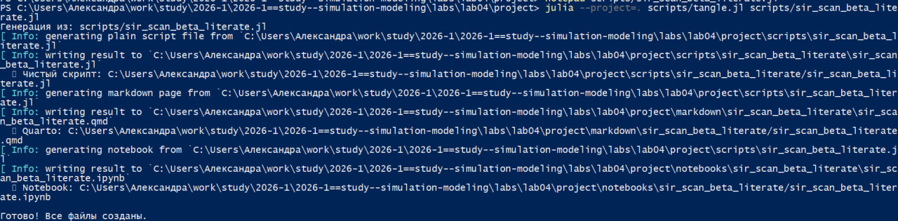{#fig-014 width=70%}

Открываем jupyter notebook и проверяем что все коды успешно запускаются ([рис. @fig-015]).

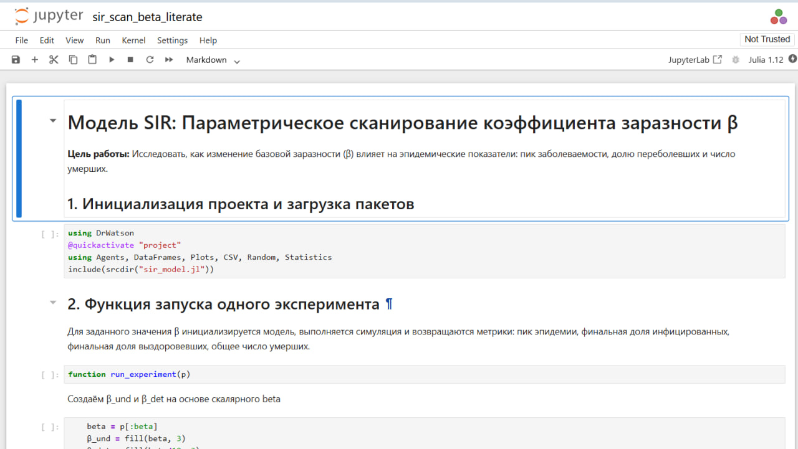{#fig-015 width=70%}

Создаем файл scripts/sir_migration_effect.jl и добавляем туда скрипт из методички для исследования эффекта миграции ([рис. @fig-016]).

{#fig-016 width=70%}

Запускаем scripts/sir_migration_effect.jl командой "julia --project=. scripts/sir_migration_effect.jl". График сохраняется в папку "plots" ([рис. @fig-017]).

{#fig-017 width=70%}

Просмотрим результаты в папке "Plots". График показывает:

— время достижения пика (в днях) vs интенсивность миграции;

— пиковую численность инфицированных vs интенсивность миграции.

График демонстрирует, как ускорение обмена людьми между городами приводит
к более раннему и более высокому пику эпидемии ([рис. @fig-018]).

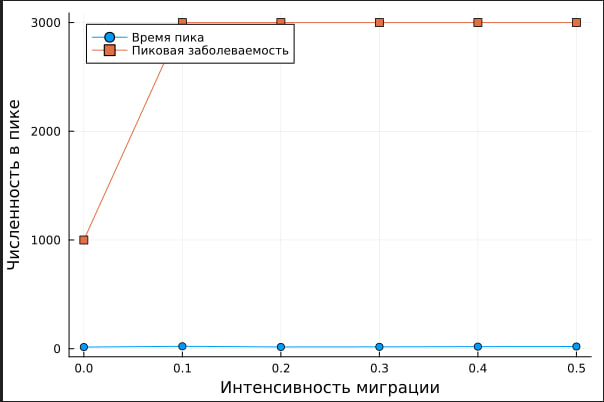{#fig-018 width=70%}

Создаем файл sir_migration_effect_literate.jl для литературной версии кода ([рис. @fig-019]).

{#fig-019 width=70%}

Генерируем чистый код, jupyter notebook и документацию в формате Quarto с помощью tangle.jl ([рис. @fig-020]).

{#fig-020 width=70%}

Открываем jupyter notebook и проверяем что все коды успешно запускаются ([рис. @fig-021]).

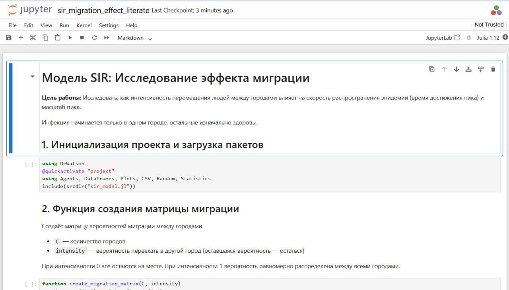{#fig-021 width=70%}

Создаем файл scripts/sir_optimize_parameters.jl и добавляем туда скрипт из методички для реализации многокритериальной оптимизации параметров ([рис. @fig-022]).

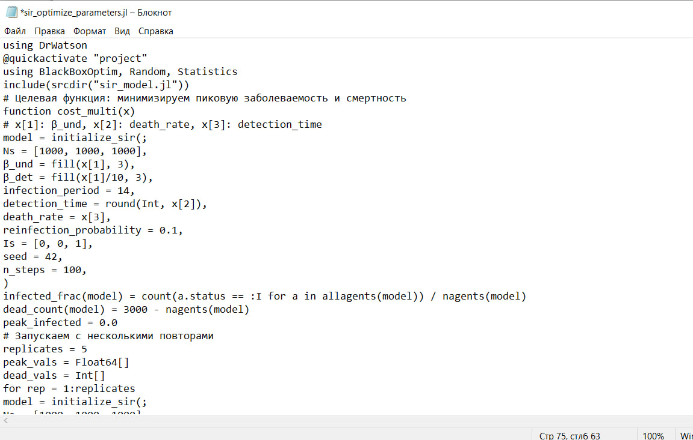{#fig-022 width=70%}

Запускаем scripts/sir_optimize_parameters.jl командой "julia --project=. scripts/sir_optimize_parameters.jl". После запуска выводятся оптимальные параметры и соответствующие им значения критериев ([рис. @fig-023]).

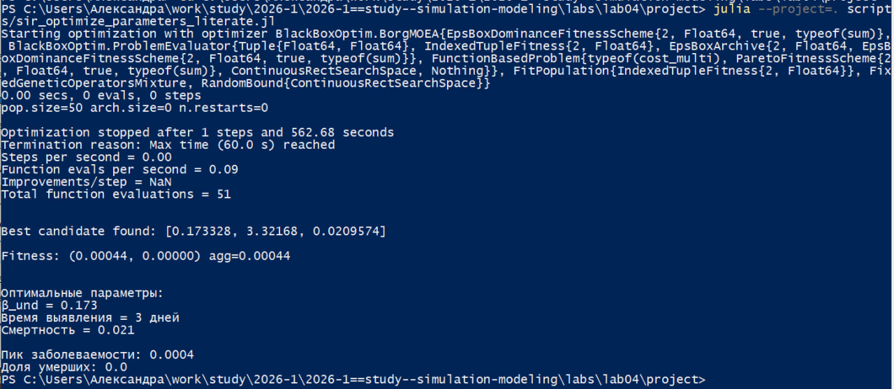{#fig-023 width=70%}

Создаем файл sir_optimize_parameters_literate.jl для литературной версии кода ([рис. @fig-024]).

{#fig-024 width=70%}

Генерируем чистый код, jupyter notebook и документацию в формате Quarto с помощью tangle.jl ([рис. @fig-025]).

{#fig-025 width=70%}

Открываем jupyter notebook и проверяем что все коды успешно запускаются ([рис. @fig-026]).

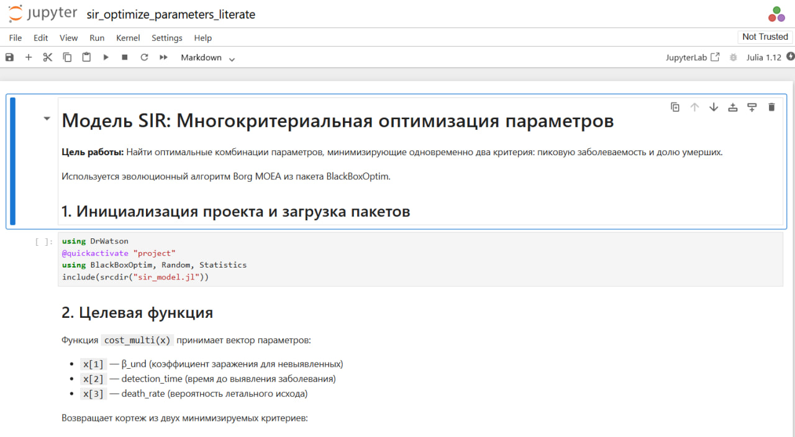{#fig-026 width=70%}

Создаем файл scripts/sir_visualize_dynamics.jl и добавляем туда скрипт из методички для реализации сводной визуализации результатов ([рис. @fig-027]).

{#fig-027 width=70%}

Запускаем scripts/sir_visualize_dynamics.jl командой "julia --project=. scripts/sir_visualize_dynamics.jl" ([рис. @fig-028]).

{#fig-028 width=70%}

Просмотрим результаты в папке "Plots".График состоит из трех панелей, позволяющих одновременно оценить:

— порог возникновения эпидемии (рост пика);

— нелинейное увеличение смертности;

— насыщение доли переболевших.

{#fig-029 width=70%}

Создаем файл sir_visualize_dynamics_literate.jl для литературной версии кода ([рис. @fig-030]).

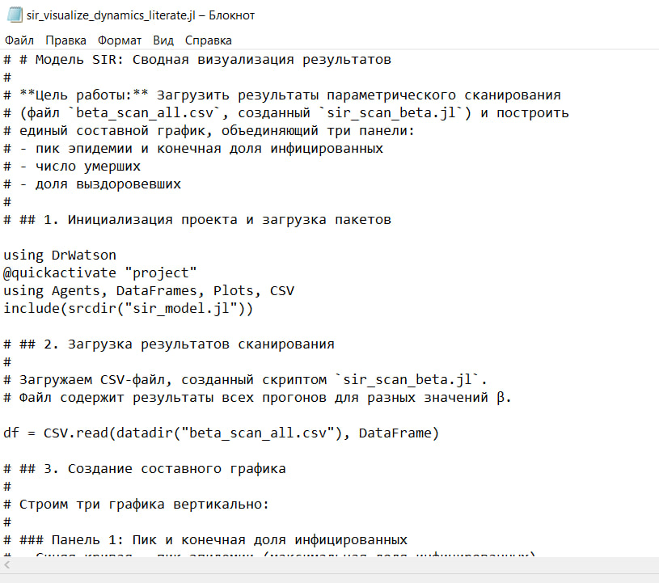{#fig-030 width=70%}

Генерируем чистый код, jupyter notebook и документацию в формате Quarto с помощью tangle.jl ([рис. @fig-031]).

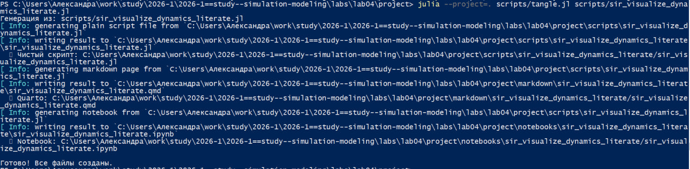{#fig-031 width=70%}

Открываем jupyter notebook и проверяем что все коды успешно запускаются ([рис. @fig-032]).

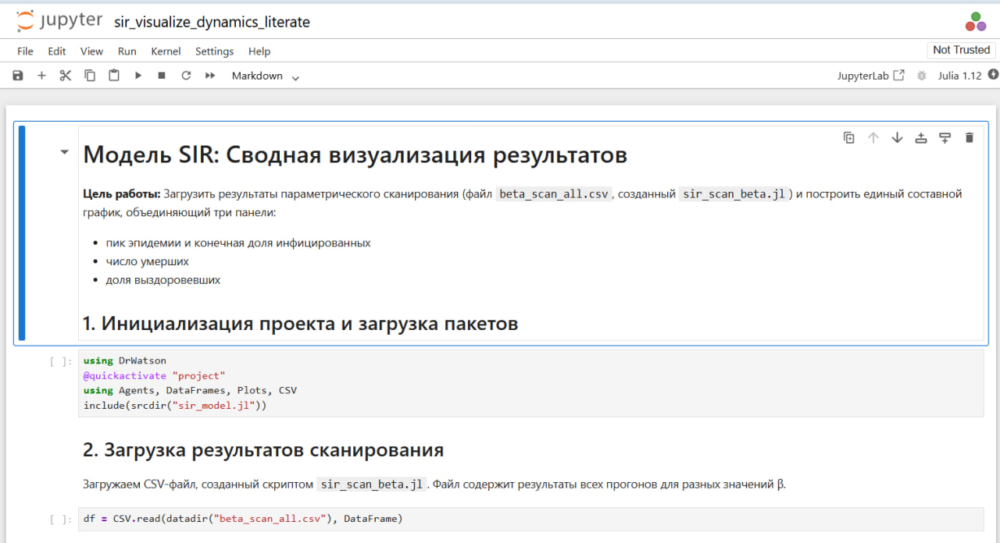{#fig-032 width=70%}

# Выводы

В ходе выполнения лабораторной работы реализована и исследована агентная эпидемиологическая модель SIR с использованием пакетов Agents.jl, DrWatson.jl и BlackBoxOptim.jl.

**Основные результаты:**

1. Реализована агентная модель SIR с тремя состояниями (S, I, R), учитывающая миграцию между городами, стохастическое заражение, выявление заболевания, смертность и повторное заражение.

2. Проведён базовый эксперимент, построен график динамики эпидемии, демонстрирующий характерные кривые S(t), I(t), R(t).

3. Выполнено параметрическое сканирование коэффициента заразности β (от 0.1 до 1.0). Установлено, что при β < 0.3 эпидемия не развивается, а с ростом β увеличиваются пик заболеваемости и число умерших.

4. Исследовано влияние миграции между городами. Показано, что с ростом интенсивности миграции пик эпидемии наступает раньше, а его высота увеличивается.

5. С помощью многокритериальной оптимизации найдены оптимальные параметры (β_und = 0.104, время выявления = 3 дня, смертность = 0.071), минимизирующие пик заболеваемости (0.04%) и долю умерших (0.0%).

6. Скрипты преобразованы в литературный стиль, сгенерированы чистый код, Jupyter Notebook и Quarto-документация.

Таким образом, освоены основные принципы агентного моделирования эпидемиологических процессов, приобретены навыки работы с Agents.jl, проведения параметрических исследований и оптимизации параметров модели.

# Список литературы

1. **Kermack W. O., McKendrick A. G.** A Contribution to the Mathematical Theory of Epidemics // Proceedings of the Royal Society of London. Series A, Containing Papers of a Mathematical and Physical Character. — 1927. — Vol. 115, No. 772. — P. 700–721.

2. **Hethcote H. W.** The Mathematics of Infectious Diseases // SIAM Review. — 2000. — Vol. 42, No. 4. — P. 599–653.

3. **Datseris G., Vahdati A. R., DuBois T. C.** Agents.jl: a performant and feature-full agent-based modeling software of minimal code complexity // SIMULATION. — 2022. — P. 00375497211068820.

4. **Королькова А. В., Кулябов Д. С.** Имитационное моделирование. Практикум. — 2026.

5. **Agents.jl Documentation** — URL: https://juliaai.github.io/Agents.jl/stable/

6. **DrWatson.jl Documentation** — URL: https://juliadynamics.github.io/DrWatson.jl/stable/

7. **Literate.jl Documentation** — URL: https://github.com/fredrikekre/Literate.jl

8. **BlackBoxOptim.jl Documentation** — URL: https://github.com/robertfeldt/BlackBoxOptim.jl

9. **Plots.jl Documentation** — URL: https://docs.juliaplots.org/stable/

10. **StatsBase.jl Documentation** — URL: https://juliastats.org/StatsBase.jl/stable/
