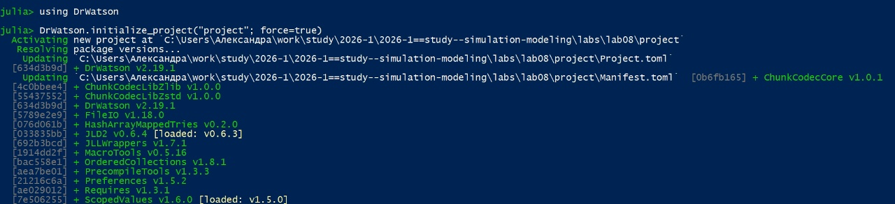
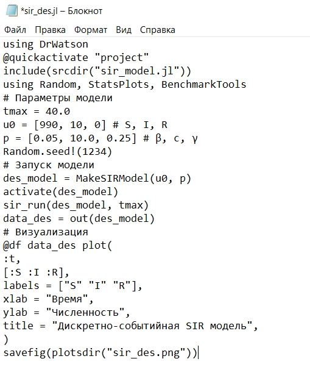
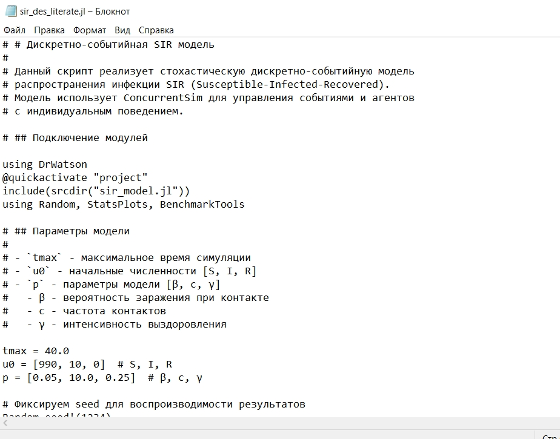
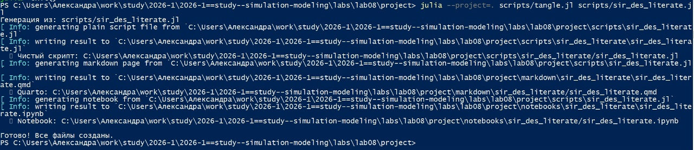
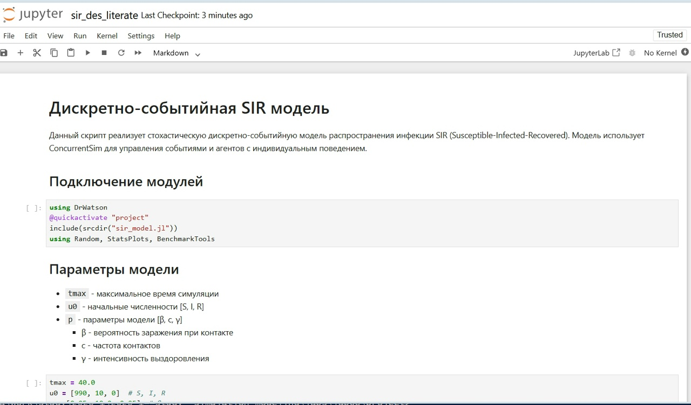

---
## Author
author:
  name: Соколова Александра Олеговна
  degrees: DSc
  orcid: 0000-0002-0877-7063
  email: 1132236034@rudn.ru
  affiliation:
    - name: Российский университет дружбы народов
      country: Российская Федерация
      postal-code: 117198
      city: Москва
      address: ул. Миклухо-Маклая, д. 7 к. 1
## Title
title: Презентация по лабораторной работе №8
subtitle: Имитационное моделирование
license: CC BY
date: today
date-format: "YYYY-MM-DD" # Example: 2025-09-06
execute:
  eval: false
---

## Цель работы

Изучить дискретно-событийный подход к имитационному моделированию на
примере классической модели распространения инфекции SIR. Реализовать стохастическую дискретно-событийную модель в виде программного комплекса на
языке Julia. Провести анализ влияния параметров, сравнить со стохастической и
детерминированной версиями, оценить производительность и модифицировать
модель.

## Подготовка рабочего пространства

Создаем проект DrWatson для выполнения лабораторной работы ([рис. @fig-001]).

{#fig-001 width=70%}

## Подготовка рабочего пространства

Запускаем проект и загружаем необходимые пакеты ([рис. @fig-002]).

{#fig-002 width=70%}

## Ядро модели

Создаем файл src/sir_model.jl и записываем туда код модели из методички. Это ядро модели, в котором определяется структура данных, функций событий, логики агентов и управления симуляцией. ([рис. @fig-003]).

{#fig-003 width=70%}

## Скрипт запуска (sir_des.jl)

Создаем файл scripts/sir_des.jl и добавляем туда скрипт запуска из методички ([рис. @fig-004]).

{#fig-004 width=70%}

## Скрипт запуска (sir_des.jl)

Запускаем scripts/sir_des.jl командой "julia --project=. scripts/sir_des.jl". График сохраняется в папку "plots" ([рис. @fig-005]).

{#fig-005 width=70%}

## Скрипт запуска (sir_des.jl)

Просмотрим результаты в папке "Plots". График показывает динамику эпидемии в дискретно-событийной SIR модели ([рис. @fig-006]).

{#fig-006 width=70%}

## Скрипт запуска (sir_des.jl)

Интерпретация графика:

Ось X – Время (модельное время симуляции от 0 до tmax = 40.0)

Ось Y – Численность (количество индивидов в каждой группе)

Три кривые на графике:

S (Susceptible / Восприимчивые) – начинается с 990 и постепенно снижается, так как люди заражаются и покидают группу восприимчивых

I (Infected / Инфицированные) – начинается с 10, затем растёт (эпидемия развивается), достигает пика, после чего снижается (люди выздоравливают)

R (Recovered / Переболевшие) – начинается с 0 и постепенно растёт, так как инфицированные выздоравливают и приобретают иммунитет

## Литературное программирование

Создаем файл tangle.jl для генерации производных форматов и добавляем туда скрипт из методички ([рис. @fig-007]).

{#fig-007 width=70%}

## Литературное программирование

Создаем файл sir_des_literate.jl для литературной версии кода ([рис. @fig-008]).

{#fig-008 width=70%}

## Генерация производных форматов

Генерируем чистый код, jupyter notebook и документацию в формате Quarto с помощью tangle.jl ([рис. @fig-009]).

{#fig-009 width=70%}

## Проверка в jupyter notebook

Открываем jupyter notebook и проверяем что все коды успешно запускаются ([рис. @fig-010]).

{#fig-010 width=70%}

## Выводы

В ходе выполнения лабораторной работы была успешно реализована и протестирована дискретно-событийная SIR модель на языке Julia. Модель позволяет наблюдать стохастическую динамику распространения инфекции, включая естественные флуктуации численности групп и пик эпидемии. Полученные результаты соответствуют теоретическим ожиданиям: при базовом репродуктивном числе R0 = 2,0 эпидемия развивается, достигает максимума и затухает, а дискретно-событийный подход демонстрирует преимущества перед детерминированным за счёт учёта случайных процессов и индивидуального поведения агентов.

