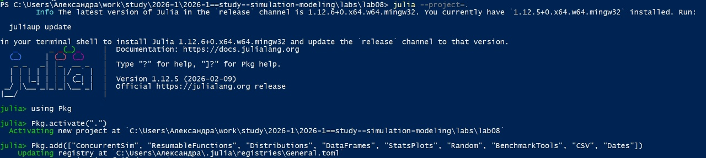
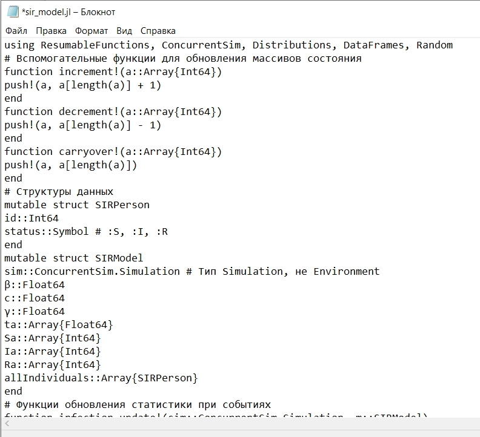
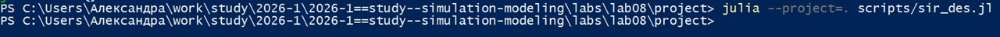
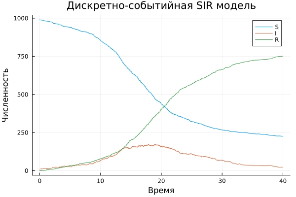
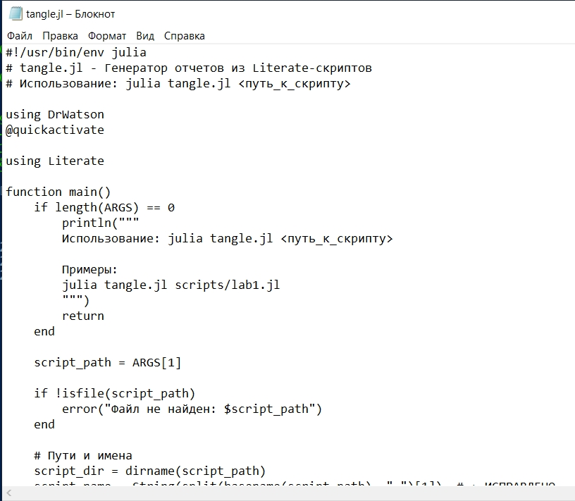

---
## Author
author:
  name: Соколова Александра Олеговна
  degrees: DSc
  orcid: 0000-0002-0877-7063
  email: 1132236034@rudn.ru
  affiliation:
    - name: Российский университет дружбы народов
      country: Российская Федерация
      postal-code: 117198
      city: Москва
      address: ул. Миклухо-Маклая, д. 7к1

## Title
title: "Отчёт по лабораторной работе №8"
subtitle: "Имитационное моделированией"
license: "CC BY"
---

# Цель работы

Изучить дискретно-событийный подход к имитационному моделированию на
примере классической модели распространения инфекции SIR. Реализовать стохастическую дискретно-событийную модель в виде программного комплекса на
языке Julia. Провести анализ влияния параметров, сравнить со стохастической и
детерминированной версиями, оценить производительность и модифицировать
модель.

# Задание

— Создать рабочий каталог для кода.

— Установить необходимые пакеты.

— Выполнить предложенный код.

— Преобразовать код в литературный стиль.

— Сгенерировать из литературного кода:

- чистый код;
-  jupyter notebook;
- документацию в формате Quarto.

— Выполнить код из jupyter notebook.

— Интегрировать документацию в формате Quarto в отчёт.

— Добавить в код в литературном стиле вычисление для набора параметров.

— Сгенерировать из литературного кода с параметрами:

- чистый код;
- jupyter notebook;
- документацию в формате Quarto.

— Выполнить код из jupyter notebook с параметрами.

— Интегрировать документацию с параметрами в формате Quarto в отчёт.

# Теоретическое введение

## 2.1. Модель SIR

Модель SIR (Susceptible-Infected-Recovered) является классической математической моделью эпидемиологии, описывающей распространение инфекционного заболевания в популяции. Модель была предложена Кермаком и МакКендриком в 1927 году.

В модели SIR вся популяция делится на три группы:

- **S (Susceptible)** – восприимчивые к заболеванию индивиды;
- **I (Infected)** – инфицированные индивиды, способные передавать инфекцию;
- **R (Recovered)** – переболевшие индивиды, приобретшие иммунитет.

## 2.2. Детерминированная версия

В классическом детерминированном подходе динамика эпидемии описывается системой обыкновенных дифференциальных уравнений:

dS/dt = -β * c * (S * I) / N

dI/dt = β * c * (S * I) / N - γ * I

dR/dt = γ * I

где:
- N = S + I + R – общая численность популяции;
- β – вероятность передачи инфекции при контакте;
- c – частота контактов;
- γ – интенсивность выздоровления.

Базовое репродуктивное число: R0 = (β * c) / γ

Если R0 > 1, эпидемия возникает; если R0 < 1, эпидемия затухает.

## 2.3. Дискретно-событийный подход

В отличие от детерминированного подхода, дискретно-событийное моделирование (DES) позволяет учитывать стохастическую природу реальных процессов. В DES время продвигается дискретно от одного события к другому.

В данной работе используется библиотека ConcurrentSim для Julia, которая предоставляет:

- виртуальное время;
- конкурентные процессы;
- события и таймеры (timeout).

## 2.4. Стохастический характер модели

В стохастической SIR модели каждый индивид моделируется как отдельный агент:

- восприимчивый индивид ожидает время до следующего контакта (экспоненциальное распределение с параметром c), выбирает случайного собеседника и с вероятностью β заражается;
- инфицированный индивид ожидает время до выздоровления (экспоненциальное распределение с параметром γ), после чего переходит в состояние R.

## 2.5. Программная реализация

Программный комплекс состоит из двух файлов:

- src/sir_model.jl – ядро модели;
- scripts/sir_des.jl – скрипт запуска.

Используемые библиотеки: ConcurrentSim, ResumableFunctions, Distributions, StatsPlots, DrWatson.

# Выполнение лабораторной работы

Создаем проект DrWatson для выполнения лабораторной работы ([рис. @fig-001]).

{#fig-001 width=70%}

Запускаем проект и загружаем необходимые пакеты ([рис. @fig-002]).

{#fig-002 width=70%}

Создаем файл src/sir_model.jl и записываем туда код модели из методички. Это ядро модели, в котором определяется структура данных, функций событий, логики агентов и управления симуляцией. ([рис. @fig-003]).

{#fig-003 width=70%}

Создаем файл scripts/sir_des.jl и добавляем туда скрипт запуска из методички ([рис. @fig-004]).

{#fig-004 width=70%}

Запускаем scripts/sir_des.jl командой "julia --project=. scripts/sir_des.jl". График сохраняется в папку "plots" ([рис. @fig-005]).

{#fig-005 width=70%}

Просмотрим результаты в папке "Plots". График показывает динамику эпидемии в дискретно-событийной SIR модели ([рис. @fig-006]).

{#fig-006 width=70%}

Интерпретация графика:

Ось X – Время (модельное время симуляции от 0 до tmax = 40.0)

Ось Y – Численность (количество индивидов в каждой группе)

Три кривые на графике:

S (Susceptible / Восприимчивые) – начинается с 990 и постепенно снижается, так как люди заражаются и покидают группу восприимчивых

I (Infected / Инфицированные) – начинается с 10, затем растёт (эпидемия развивается), достигает пика, после чего снижается (люди выздоравливают)

R (Recovered / Переболевшие) – начинается с 0 и постепенно растёт, так как инфицированные выздоравливают и приобретают иммунитет

Создаем файл tangle.jl для генерации производных форматов и добавляем туда скрипт из методички ([рис. @fig-007]).

{#fig-007 width=70%}

Создаем файл sir_des_literate.jl для литературной версии кода ([рис. @fig-008]).

{#fig-008 width=70%}

Генерируем чистый код, jupyter notebook и документацию в формате Quarto с помощью tangle.jl ([рис. @fig-009]).

{#fig-009 width=70%}

Открываем jupyter notebook и проверяем что все коды успешно запускаются ([рис. @fig-010]).

{#fig-010 width=70%}

# Выводы

В ходе выполнения лабораторной работы были достигнуты следующие результаты:

1. Реализована дискретно-событийная модель SIR на языке Julia. Модель соответствует теоретическому описанию и учитывает индивидуальное поведение каждого агента.

2. Выполнена симуляция эпидемического процесса с заданными параметрами. Полученные результаты демонстрируют классическую динамику SIR-модели.

3. Проведена визуализация результатов в виде графиков временных рядов S(t), I(t), R(t).

4. Показаны преимущества дискретно-событийного подхода по сравнению с детерминированным: учёт стохастической природы, возможность наблюдения флуктуаций.

5. Освоены принципы работы с библиотекой ConcurrentSim.

# Список литературы

1. Kermack W. O., McKendrick A. G. (1927). "A Contribution to the Mathematical Theory of Epidemics". Proceedings of the Royal Society A, 115(772), 700-721.

2. Ross S. M. (2019). "Introduction to Probability Models". 12th Edition. Academic Press.

3. Banks J., Carson J. S., Nelson B. L., Nicol D. M. (2014). "Discrete-Event System Simulation". 5th Edition. Pearson.

4. Документация ConcurrentSim.jl

5. Документация DrWatson.jl

6. Документация StatsPlots.jl
